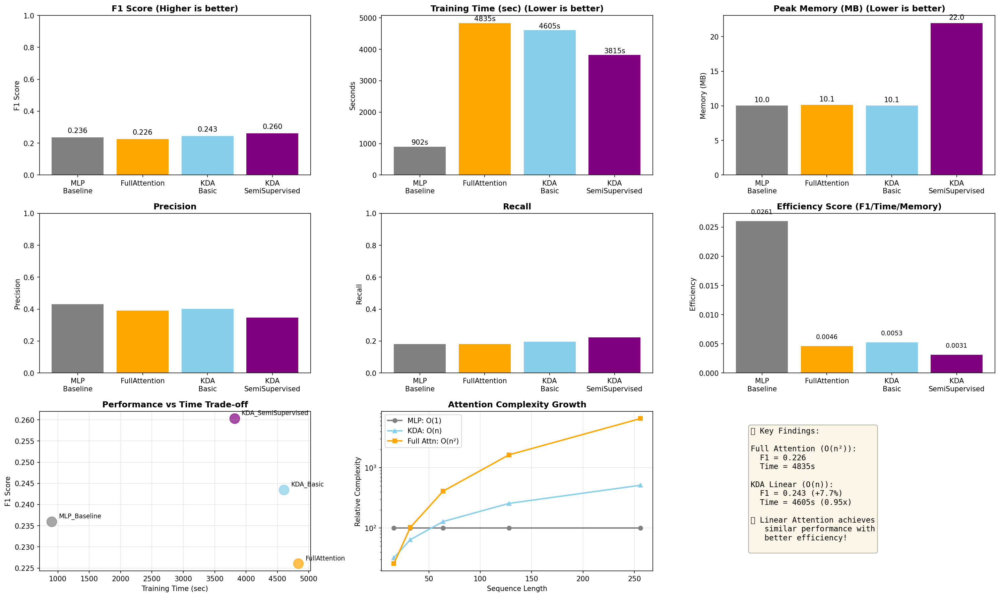

# 문제 정의
Labeling 이 된 GoEmotion과 Labeling 이 안된 Reddit 를 통해,  
반지도학습을 하여, 28가지 감성을 분류하는 모델을 구현하고자 했습니다.

# 데이터
GoEmotion: https://research.google/blog/goemotions-a-dataset-for-fine-grained-emotion-classification/
Reddit: https://www.reddit.com/dev/api/

# 모델
MLP, Full Attention, kimi Delta Attention(반지도학습 X), Kimi Delta Attention(반지도학습 O) 의 4가지로 나누어 성능을 평가합니다.  

이에 따라, Attention 의 성능이 우세하며, KDA 의 효율이 더 좋을 것으로 예상합니다.  

# Kimi Delta Attention
해당 모델은 [다음의 깃허브](https://github.com/MoonshotAI/Kimi-Linear?tab=readme-ov-file) 를 참고한 모델로, 경량화되었지만, 효율을 유지하고 있는 Linear Attention 이 핵심입니다.
논문의 구조를 참고하여, 단순화한 모델입니다.

## Linear Attention
기존의 Attention 은 $N \times N$ 크기의 Attention Matrix 를 전달하여, 그 크기가 길이의 제곱으로 늘어난다는 단점이 있었습니다.  

이에 대해, 고정된 크기의 $d \times d$ 인 상태 행렬 $S$ 를 활용합니다.  
이를 위해서 Linear Attention 에서는 정보에 대해 쓰기도 하지만, 삭제하기도 합니다.  

이 삭제의 방법에는 Delta Rule 과 Fine-grained Gating 이 존재합니다.  

### Delta Rule
최신의 데이터를 기존의 데이터에 대해 업데이트합니다.  
즉, 새로운 데이터 이전에 비슷한 과거의 데이터를 제거하고 업데이트 됩니다.  

### Fine-Grained Gating
모든 정보를 동일한 비율로 제거한 이전의 모델과 다르게,  
어떤 정보이냐에 따라 다른 비율로 제거합니다.  
이를 통해, 중요한 데이터는 상대적으로 천천히 제거됩니다.

앞의 2개의 단계를 거친 후, 새로운 데이터는 행렬 $S$ 에 새롭게 추가됩니다.

위의 과정을 반복함으로서 속도는 유지하면서, 필요한 정보를 적절하게 유지하게 됩니다.

# 파일 설명
## `config.py`
전체 학습 및 테스트에 사용되는 하이퍼파라미터를 정의합니다.

## `models.py`
실험에 사용될 모델을 정의합니다.  
MLP, full attention, kimi linear attention 이 정의되어있습니다.  
그 외로, 공통적으로 사용할 HuggingFace Tokenizer 가 정의되어있습니다.

## `run_XXX.py`
각 모델에 대해서 학습, 평가, 모델 및 결과 저장을 수행합니다.  

평가는 학습시간, 메모리 사용량, Precision, Recall, F1-score 를 평가합니다.

## `utils.py`
학습시간, 메모리 사용량, 데이터 로딩, 학습, f1-score 계산 관련 함수가 모아져있습니다.

## `compare_models.py`
수집된 데이터를 바탕으로 모델간의 비교를 그래프로 표현합니다. 결과는 다음 그림과 같습니다.


## 반지도학습

`run_kda_semi.py`는 Pseudo-labeling 기법을 사용:

1. **Labeled 데이터로 모델 학습** (Epoch 1-2)
2. **신뢰도가 높은 예측 생성** (Epoch 3~)
```python
   # Confidence > 0.85인 샘플만 선택
   if probs > 0.85:
       pseudo_labeled_data.append(sample)
```
3. **Pseudo-labeled 데이터로 추가 학습**
   - Labeled + Pseudo-labeled 데이터 결합 학습

이를 통해 Unlabeled Reddit 데이터를 활용하여 성능 향상을 유도합니다.